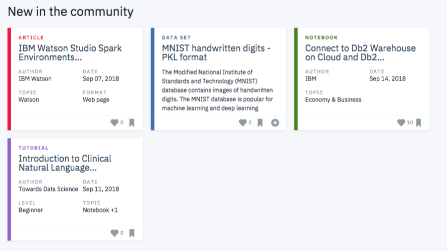

# Recommendations-with-IBM---Udacity-Data-Scientist-Nanodegree Program

## Recommendations_with_IBM

## Required libraries to be imported

- python 3.6.3
- pandas 0.20.3
- numpy 1.12.1
- matplotlib 2.1.0
- sklearn 0.19.1

## Project description and Motivation

For this project, I observed interactions of different users with articles on the IBM Watson Studio platform. Below is an example of what a dashboard looks like while displaying articles on the IBM Platform.

The above dashboard depicts the newest articles. It can also have a recommendation board available that shows the articles that are most pertinent and based on the needs to a specific user.

For determining which articles need to be shown to each user, I performed Exploratory data analysis and buit a recommendation platform by studying the data available on the [IBM Watson Studio platform](https://dataplatform.cloud.ibm.com/).

## Files

- Recommendations_with_IBM.ipynb: The Notebook is a precise description of how articles are recommended to different users
- Recommendations_with_IBM.html: Same as the above Jupyter Notebook file but in an HTML format.

## Acknowledgements

I would like to acknowledge and thank [IBM Watson Studio platform](https://dataplatform.cloud.ibm.com/) for the articles community and user item interaction datasets and [Udacity](https://www.udacity.com/)  developing a highly intense project.
